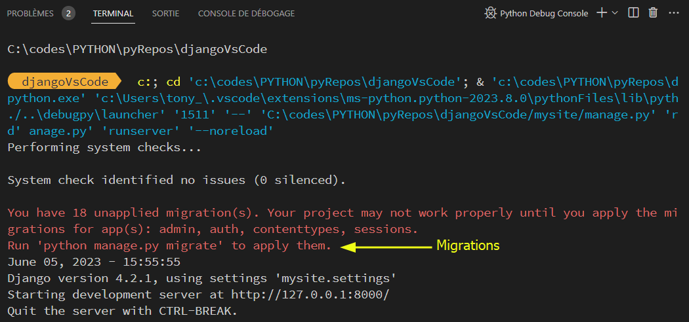
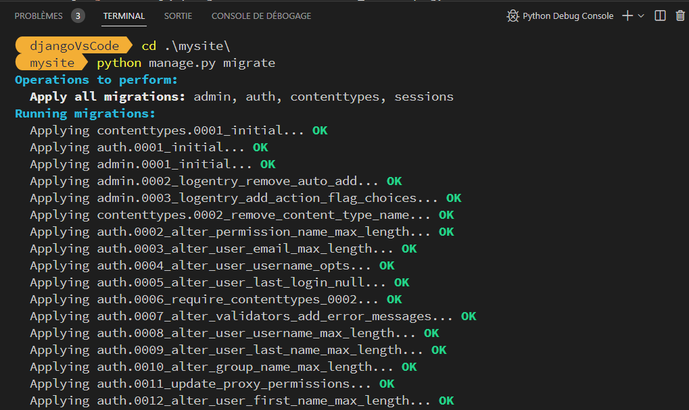

# DjangoApp

Scaffold for Django application web framework (Python) on Windows. A few steps to start coding with VsCode or VSCodium.

[Django](https://www.djangoproject.com) is a high-level Python web framework that encourages rapid development and clean, pragmatic design. Built by experienced developers, it takes care of much of the hassle of web development, so you can focus on writing your app without needing to reinvent the wheel. It’s free and open source.

Powershell & Project Directory

```powershel
pwsh --version
PowerShell 7.3.4

pwd
Path
----
C:\codes\PYTHON\pyRepos\djangoVsCode
```

## Install VsCode or VSCodium

* [VSCodium](https://github.com/VSCodium/vscodium) 'Binary releases of VS Code without MS branding/telemetry/licensing'  
* [Visual Studio Code](https://code.visualstudio.com) 'see licese : <https://code.visualstudio.com/License/>'

## Install Python

* <https://www.python.org/downloads/>
* Now (june 23): **python-3.12.0b1-amd64**

## Install virtualenv

Virtualenv is a tool to create isolated Python environments.

#### Install

* <https://virtualenv.pypa.io/en/latest/installation.html>

#### Create venv

```bash
python -m venv C:\codes\PYTHON\pyRepos\djangoVsCode
```

#### Activate venv

```bash
c:/codes/PYTHON/pyRepos/djangoVsCode/Scripts/Activate.ps1
```

Python version

```bash
python --version
Python 3.11.1  
```

## Install Django

```bash
pip install django
```

```bash
python -m django --version
4.2.1
```

### Creation django app

```bash
django-admin startproject mysite
```

## Configure VSCode to serve app

Step 1. Install following plugins

* Python (by microsoft)
* Live Server

Step 2. Set python version to your virtual env by following these steps in bullets in order

1. Press `CTRL+SHIFT+P`
This will open a command pallet in vscode.
2. Set the python version by selecting if it is visible in the dropdowns or by typing it like
`Python > <path-to-venv>/bin/python`
3. create launch.json (normally it is automatically created when you press run button so first press run and see if it runs or not and then check or create launch.json)
4. add this as contents of launch.json

thx: [noobsnoob.blogspot.com](https://noobsnoob.blogspot.com/2023/06/how-to-run-django-server-from-vscode.html)

exemple:  
```json
{
  // Utilisez IntelliSense pour en savoir plus sur les attributs possibles.
  // Pointez pour afficher la description des attributs existants.
  // Pour plus d'informations, visitez : https://go.microsoft.com/fwlink/?linkid=830387
  "version": "0.2.0",
  "configurations": [
    {
      "name": "Python : My Django",
      "type": "python",
      "request": "launch",
      "program": "${workspaceFolder}/mysite/manage.py",
            "args": [
                "runserver",
                "--noreload"
            ],
            "django": true,
            "justMyCode": true
    }
  ]
}
```

## F5



**Ctrl + C** and : 

```powershell
python manage.py migrate
```

### Migrate



F5 again :


The install worked successfully! Congratulations!

**Ctrl + C** & make a **requirements.txt**

```bash
pip freeze > requirements.txt

type .\requirements.txt
asgiref==3.7.2
Django==4.2.1
sqlparse==0.4.4
tzdata==2023.3
```

[Wanna just docs ?](https://docs.djangoproject.com/en/4.2/)

## Coding

> If you want a .gitignore file 

```powhershell

# Source file location (github .gitignore for python)
$source = 'https://raw.githubusercontent.com/github/gitignore/main/Python.gitignore'
# Destination to save the file (Your project)
$destination = 'C:\codes\PYTHON\pyRepos\djangoVsCode\.gitignore'
#Download the file
Invoke-WebRequest -Uri $source -OutFile $destination
```

... Hey wizards, do magic things now ;)
